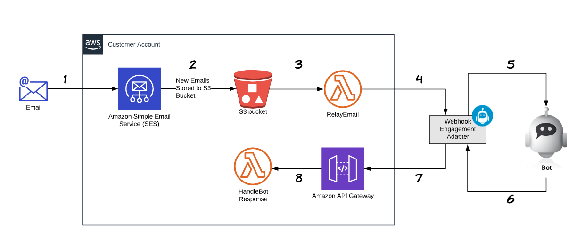

# WebSpray

Demonstrate use of ServisBOT's webhook adapter.

## Overview

OSS to ingest S3 events into a lambda and send them to the ServisBOT web hook adaptor 



## Get Started

1. Make sure the [Serverless Framework](https://www.serverless.com/) is installed. Installation instructions can be found [here](https://www.serverless.com/framework/docs/providers/aws/guide/installation/)
2. Ensure the bot is setup with a [Webhook Endpoint](https://docs.servisbot.com/product-features/engagement-adapters/webhook/)
   1. You won't know the *EngagementConfig Url* just yet. Write anything you want there, we will update it later.
3. `npm i`
4. Edit the `package.json` file and replace placeholder values in the `deploy` script with your values
   E.g. `npm run preDeploy && sls deploy --aws-profile myAwsAccount --region eu-west-1 --sb_region eu-1 --organization acmeorg --api_key \"Bearer 40390422-99c7-1234-a9ce-a59010a4ff16\" --bot_endpoint acmeorg-default && npm run postDeploy`
5. `npm run deploy`
6. Once the deploy has finished you will need to grab the URL for the webhook. This will be printed out in the output of the `deploy` script. It will looks like this:
```
   endpoints:
    POST - https://xxxxxxxxx.execute-api.us-east-1.amazonaws.com/dev/HandleBotResponse

```
7. Now use that url to update the *EngagementConfig Url* in your webhook endpoint.
8. [Simulate new email messages](https://github.com/servisbot/WebSpray#simulate-email), and you should see the flow of message in the logs of both Lambda functions.
   
Small note: the S3 event trigger for the lambda can sometimes take a few minutes to be fully set up, even after the deploy has finished. 

### Simulate email

Push an email or multiple emails to the bucket used for testing:

`aws s3 cp data/sample-ses-email.txt s3://created-bucket-from-stack/sample-ses-email.txt`


## Securing your API gateway
To setup API gateway to use your API Key use this as a reference 
https://docs.aws.amazon.com/apigateway/latest/developerguide/api-gateway-setup-api-key-with-console.html


## References

https://docs.aws.amazon.com/ses/latest/DeveloperGuide/receiving-email.html  
https://docs.aws.amazon.com/ses/latest/DeveloperGuide/receiving-email-action-s3.html
